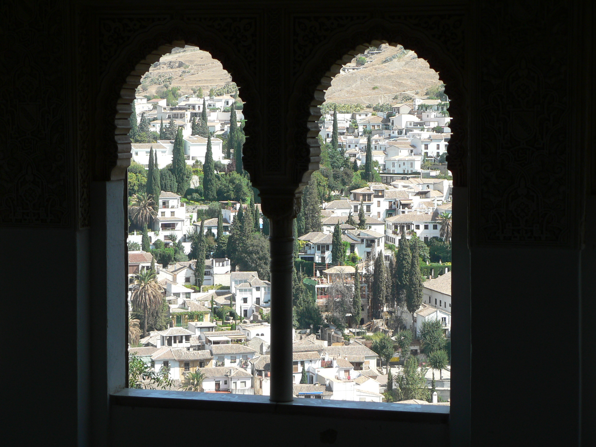
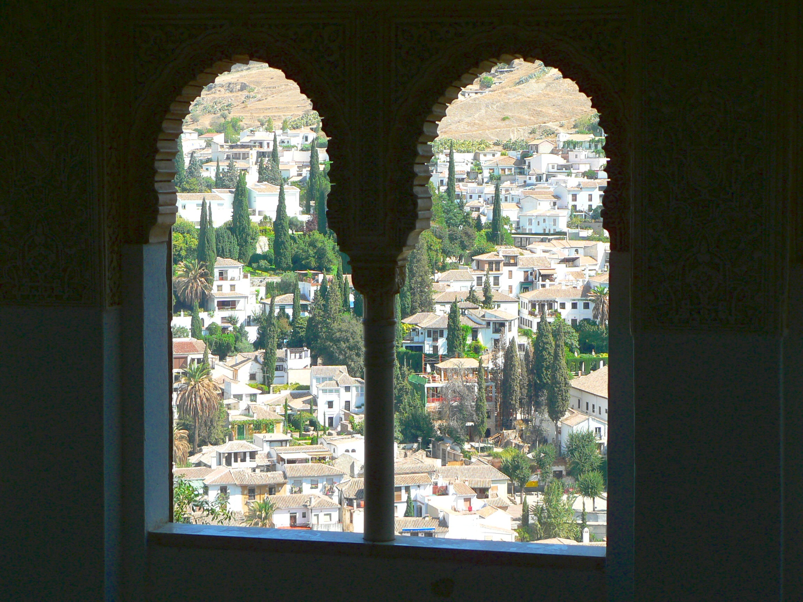
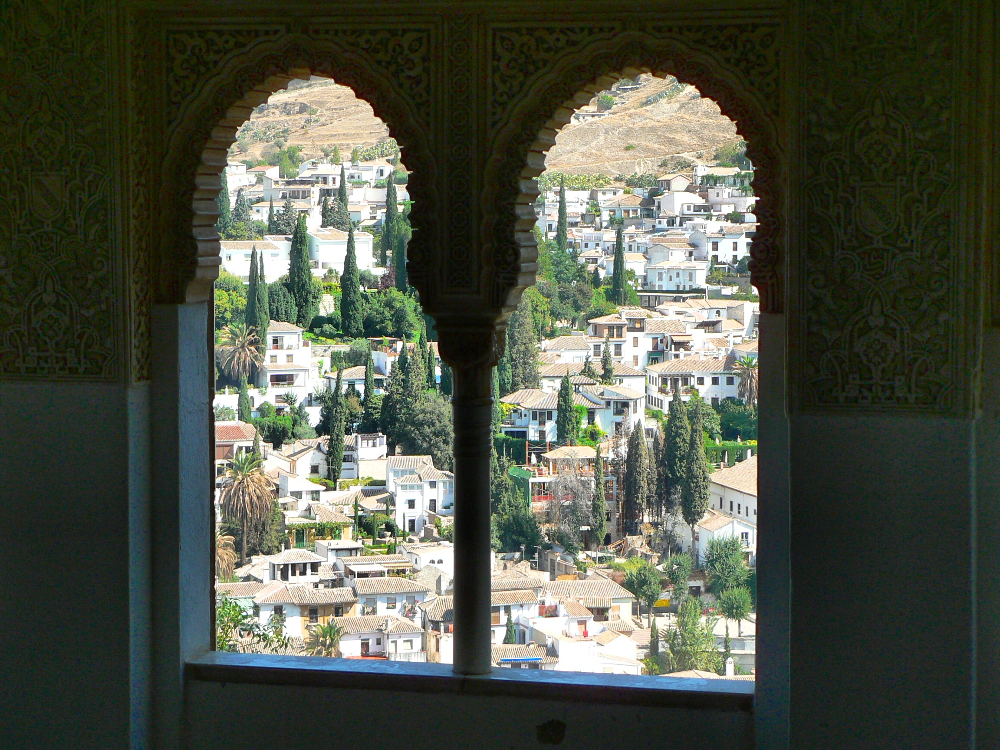
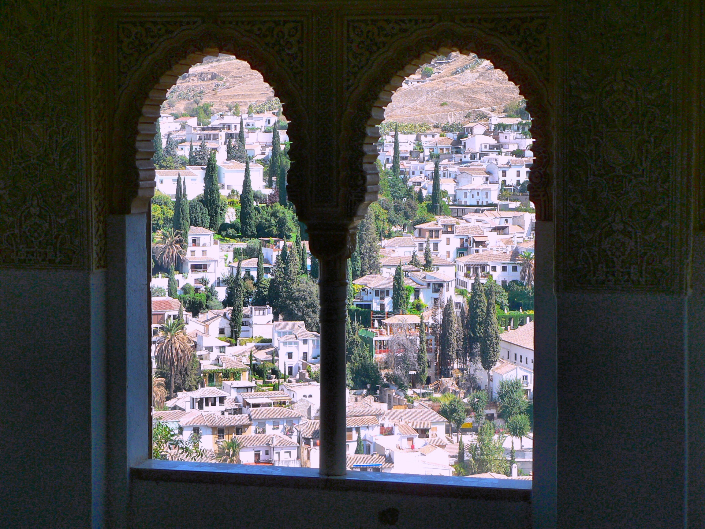
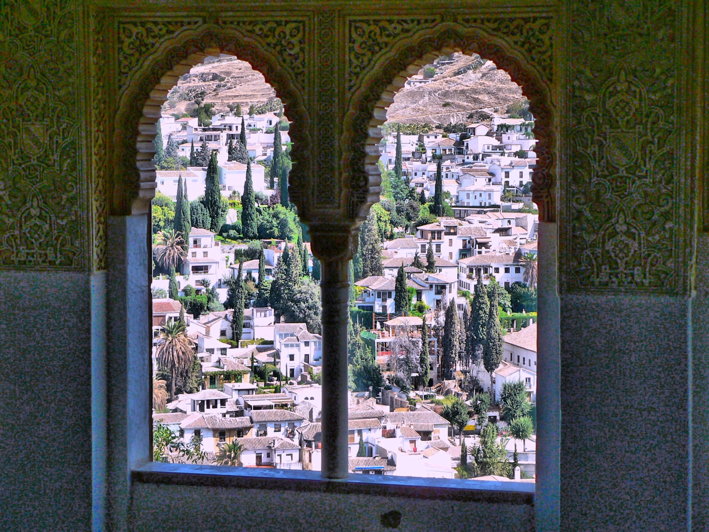

# Image Enhancement Script

This Python script enhances images through a multi-stage pipeline, improving their visual quality. The pipeline includes:

*   Brightness and saturation adjustment
*   White balancing
*   Contrast enhancement using CLAHE (Contrast Limited Adaptive Histogram Equalization)
*   Denoising

## Example Results

The table below shows examples of the enhancement pipeline's effects on an image, demonstrating the impact of different parameter combinations.

<table style="width:100%; text-align: center;">
  <tr>
    <th style="text-align: center;">Original</th>
    <th style="text-align: center;">Brightness: 20, Saturation: 1.5, White Balance: Percentile</th>
  </tr>
  <tr>
    <td></td>
    <td></td>
  </tr>
    <tr>
    <th style="text-align: center;">Brightness: 20, Saturation: 1.5, White Balance: Percentile, with CLAHE</th>
    <th style="text-align: center;">Brightness: 20, Saturation: 1.5, White Balance: Gray World, with CLAHE</th>
  </tr>
  <tr>
    <td></td>
    <td></td>
  </tr>
    <tr>
      <th colspan="2" style="text-align: center;">Final Enhanced Image</th>
    </tr>
        <tr>
      <td colspan="2" style="text-align: center;"></td>
    </tr>
</table>

The final enhanced image above was generated by further processing the "Gray World with CLAHE" image with the following parameters:

*   Brightness factor: 10
*   CLAHE kernel size: 20
*   Denoising applied

## TODO
- Implement single image Tone-Mapping: https://www.mdpi.com/1424-8220/20/16/4378